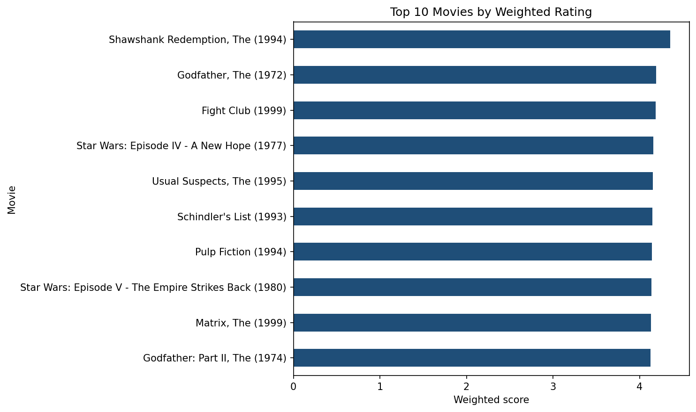
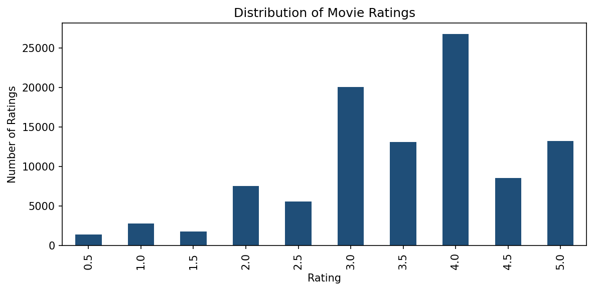

# DSA 4060 Week 1 Popularity Recommender

A non-personalized movie recommender built on the MovieLens `ml-latest-small` dataset, comparing a
minimum-rating popularity baseline against a weighted-rating baseline.

## Student

- **Name:** Justice Chawanda
- **Student number:** 670444
- **Course:** DSA 4060 Recommender Systems
- **Practical:** Week 1

## Project overview

This project explores MovieLens user-item ratings and builds two non-personalized movie
recommendation baselines. Every user receives the same ranked list, which makes the result a
transparent reference point that the personalized models built later in the course can be measured
against.

The central problem the notebook addresses is that **average rating alone cannot rank movies**. In
this dataset 296 movies hold a perfect 5.0 average, and 35.4% of rated movies were rated exactly
once — so an unfiltered "highest average" list consists entirely of films rated once or twice by a
single generous user. The two baselines are two different corrections for that problem: one excludes
thin evidence, the other discounts it.

## Dataset

**MovieLens `ml-latest-small`**, GroupLens Research, University of Minnesota.

| | |
|---|---|
| Source | <https://grouplens.org/datasets/movielens/> |
| Files used | `data/movies.csv`, `data/ratings.csv` |
| Dataset version | `ml-latest-small` (released September 2018) |
| Date accessed | 20 September 2026 |
| Ratings | 100,836 |
| Users | 610 |
| Movies in catalogue | 9,742 (9,724 with at least one rating) |
| Rating scale | 0.5 – 5.0 in half-star steps |
| Ratings collected | March 1996 – September 2018 |

The dataset's own `README.txt` is retained in `data/MOVIELENS_README.txt` with its usage licence.
The files are redistributed here under that licence for coursework purposes; if you clone this
repository and the CSVs are absent, see [How to run](#how-to-run) below.

**Citation.** F. Maxwell Harper and Joseph A. Konstan. 2015. *The MovieLens Datasets: History and
Context.* ACM Transactions on Interactive Intelligent Systems (TiiS) 5, 4: 19:1–19:19.
<https://doi.org/10.1145/2827872>

## Methods

1. **Rating-count and average-rating exploration** — ratings per user and per movie, the rating
   distribution, and the sparsity of the user-item interaction matrix.
2. **Minimum-rating popularity baseline** — require at least 50 ratings, then rank by average
   rating.
3. **Weighted-rating baseline** — score every qualifying movie with

   ```
   weighted score = (v / (v + m)) * R + (m / (v + m)) * C
   ```

   where `R` is the movie's average rating, `v` its rating count, `C` the overall mean rating
   (3.502) and `m` the minimum evidence threshold, taken as the 90th percentile of rating count
   (27.0). Movies with few ratings are pulled toward `C`; movies with many are judged on their own
   average.

## How to run

1. Clone the repository.
2. Install packages: `pip install -r requirements.txt`
3. Place the required CSV files in `data/` if they are omitted. Download
   **MovieLens latest-small** from <https://grouplens.org/datasets/movielens/>, extract the ZIP, and
   copy `movies.csv` and `ratings.csv` into `data/` without renaming any columns.
4. Open `notebooks/week1_popularity_recommender.ipynb`.
5. Run all cells from top to bottom.

The notebook uses paths relative to the project root, so no edits are needed after cloning. To run
it in Google Colab, upload the two CSV files and change `PROJECT_ROOT` in section 3.2 to the upload
location.

## Key findings

**The interaction matrix is 98.30% sparse.** A complete matrix would hold 610 × 9,724 = 5,931,640
cells; only 100,836 are filled, so the average user has rated under 2% of the catalogue.

**Both margins are heavily skewed.** The median user has rated 70 movies while the most active has
rated 2,698. More consequentially, the median *movie* has only 3 ratings and the 25th percentile is
1 — so the typical movie carries almost no evidence about its quality. Ratings themselves lean
positive, peaking at 4.0 with an overall mean of 3.502.

**The most-rated movie is not the best-rated.** *Forrest Gump (1994)* leads on volume with 329
ratings at an average of 4.164, while *The Shawshank Redemption (1994)* has 12 fewer ratings and a
materially higher average of 4.429.

**Both baselines rank Shawshank first** — at 4.429 under the 50-rating threshold, and at a weighted
score of 4.356. Winning on both average rating and volume, it is not dislodged by any reasonable
weighting of the two.

**The weighted score is the more conservative method.** It admits more candidates (976 movies versus
450) yet recommends better-evidenced ones: its median recommendation carries 219 ratings against 113
for the threshold list, and nothing in its Top 10 has fewer than 129 ratings.

**Only 4 of 10 titles appear in both lists** — *The Shawshank Redemption*, *The Godfather*,
*The Godfather: Part II* and *Fight Club*. These are the recommendations robust to the choice of
method. The threshold list keeps films sitting just past the cutoff (*Cool Hand Luke*, 57 ratings);
the weighted list replaces them with heavily-rated films of slightly lower average (*Pulp Fiction*,
307 ratings).

**Thresholds change the answer.** Lowering the minimum to 20 ratings puts *A Streetcar Named Desire
(1951)* first on an average of 4.475 from exactly 20 ratings — a ranking one additional rating could
overturn. Raising it to 100 leaves just 138 movies (1.4% of the catalogue) and a stable but
thoroughly mainstream list.

### Top 10 by weighted rating

| # | Title | Ratings | Average | Weighted |
|---|---|---|---|---|
| 1 | Shawshank Redemption, The (1994) | 317 | 4.429 | 4.356 |
| 2 | Godfather, The (1972) | 192 | 4.289 | 4.192 |
| 3 | Fight Club (1999) | 218 | 4.273 | 4.188 |
| 4 | Star Wars: Episode IV - A New Hope (1977) | 251 | 4.231 | 4.160 |
| 5 | Usual Suspects, The (1995) | 204 | 4.238 | 4.152 |
| 6 | Schindler's List (1993) | 220 | 4.225 | 4.146 |
| 7 | Pulp Fiction (1994) | 307 | 4.197 | 4.141 |
| 8 | Star Wars: Episode V - The Empire Strikes Back (1980) | 211 | 4.216 | 4.135 |
| 9 | Matrix, The (1999) | 278 | 4.192 | 4.131 |
| 10 | Godfather: Part II, The (1974) | 129 | 4.260 | 4.128 |

## Limitations

**Not personalized.** The user dimension is discarded by the first `groupby('movieId')`, which
collapses all 100,836 interactions into one row per movie. Nothing downstream consults `userId`, so
the recommender has no input that varies by person and every visitor receives an identical list by
construction. A user who watches only documentaries and a user who watches only horror get the same
ten crime and drama films.

**Popularity bias, with a feedback loop.** Both methods require substantial rating volume, which
only accrues to films that were already widely seen. Recommending them drives more views, more
ratings and a higher ranking, entrenching the same titles. The 3,446 movies with a single rating can
never enter the list, so the long tail is structurally unreachable and catalogue diversity narrows
over time. Films from under-represented regions, languages, genres and eras are disadvantaged
regardless of quality.

**Cold start.** A film with no ratings cannot be aggregated, ranked or recommended. The 18 unrated
catalogue movies here are invisible to every method in the notebook, and so would be any new release
— precisely the titles a streaming service most needs to promote.

**No handling of time.** Every rating is weighted equally whether given in 1996 or 2018, despite the
data spanning 22 years. The `timestamp` column is never used, and the recommendations skew toward
1970s–1990s films partly as an artefact of when the ratings were collected.

**A rating does not explain itself.** A 4.5 records *that* a user approved, not *why*. Without that,
the system cannot generalize the reason to other films — the ceiling on any purely ratings-based
method.

**No evaluation against held-out data.** The assertions in Part 7 check structure, not quality. No
train/test split was made, so there is evidence of internal consistency but none of predictive
performance.

**Arbitrary policy parameters.** Both the 50-rating threshold and the 90th percentile are choices,
not findings, and moving them materially changes the output. The Top 10 weighted scores also span
only about 0.23 stars, so membership in the list carries far more meaning than position within it.

## Repository structure

```
dsa4060-week1-recommender/
├── data/
│   ├── movies.csv                      Movie catalogue: movieId, title, genres
│   ├── ratings.csv                     Interactions: userId, movieId, rating, timestamp
│   └── MOVIELENS_README.txt            GroupLens dataset README and usage licence
├── images/
│   ├── top10_recommendations.png       Top 10 by weighted rating (saved by the notebook)
│   └── rating_distribution.png         Distribution of the 100,836 ratings
├── notebooks/
│   └── week1_popularity_recommender.ipynb   The full analysis, executed top to bottom
├── .gitignore
├── README.md
└── requirements.txt
```

The notebook is the single deliverable and follows the practical's structure: Part 1 frames the
problem, Part 3 loads and validates, Part 4 explores the interactions, Part 5 builds the popularity
baseline, Part 6 the weighted baseline, Part 7 visualizes and tests, and Part 8 interprets the
results and limitations.

## Screenshot




